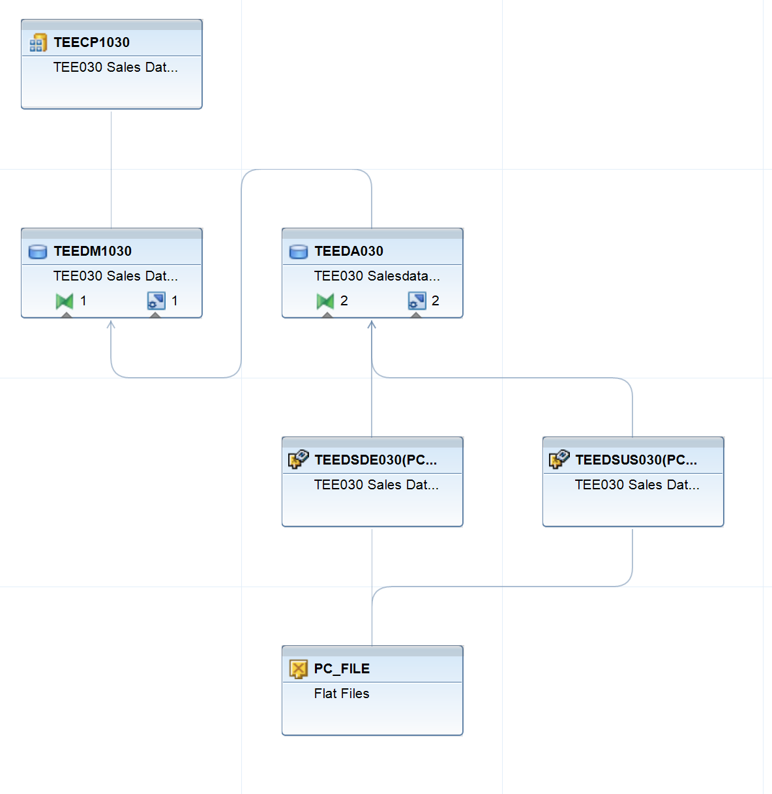

# SAP BW ETL Process Description

## Objective
Design and implementation of structured ETL processes in SAP BW to transform flat file source data into validated, reporting-ready DataMart structures. This project demonstrates practical data warehouse modeling and ETL structuring in an SAP BW environment.

---

## ETL Flow – Sales Data

The sales data flow illustrates the structured extraction, transformation and loading process within SAP BW.

Flat File (PC_FILE)  
→ DataSource  
→ Data Transfer Process (DTP)  
→ Transformation (field mapping & validation)  
→ DataMart / InfoProvider  

---

## ETL Flow – Master Data

The master data flow focuses on harmonization and structured loading into reporting-relevant objects.

Flat File (PC_FILE)  
→ DataSource  
→ Data Transfer Process (DTP)  
→ Transformation (mapping & consistency checks)  
→ InfoObject / DataMart  

---

## Key Concepts Implemented

- DataSource configuration  
- Data Transfer Process (DTP) setup  
- Transformation rules & field mapping  
- Data validation & consistency checks  
- DataMart modeling  
- Reporting layer structuring  

---

## Reporting Layer

The final DataMart layer enables structured KPI reporting based on validated and harmonized data flows, ensuring data consistency and analytical reliability.
